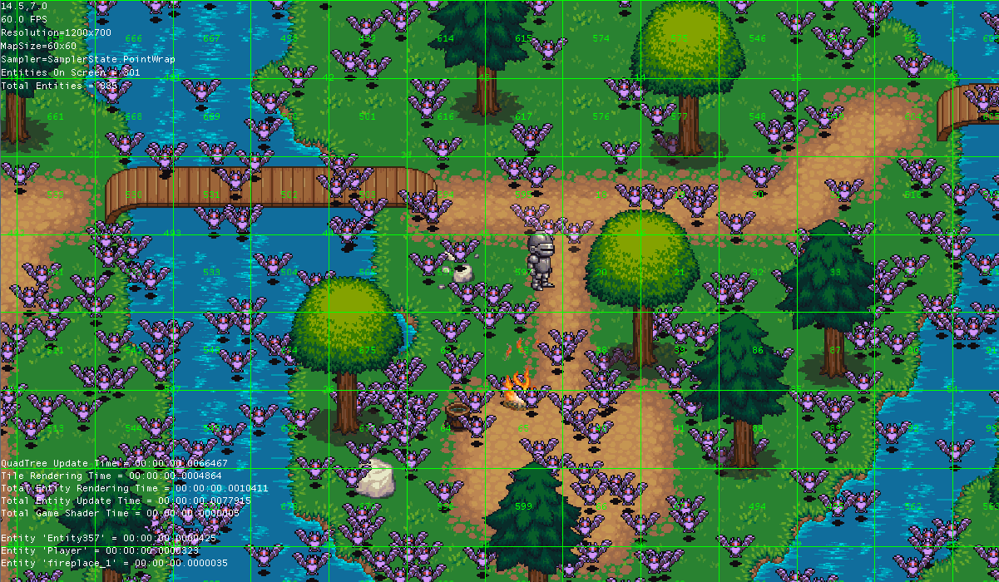

Game Development
================

This GIT hub project is my way of getting familiar with game development techniques used in many modern day games. I chose 
to first focus on 2D development since this would provide me with a nice starting point, all the while being
able to make use of more advanced techniques like shaders. I also have a personal love for retro 2D games like the older
final fantasy series and other SNES titles.

Contribution
============

If anyone wishes to contact me about possibly contributing to the project they may do so by emailing me on michaelaquilina (AT) gmail.com.

I am mainly in need of artists and sound engineers - however programmers and game designers are also welcome to contribute.

Wiki
----

I am doing my best to keep the WIKI updated. I am using the WIKI as a place to store documentation related to the code being developed.
https://github.com/KillaW0lf04/Some-2D-RPG/wiki

Suggestions and Feedback
------------------------

If you have any suggestions or feedback that you would like to give regarding this project then feel free to post in the
'Issues' section of this repository. 

Development Platform
--------------------
I decided to make use of XNA becauase i feel very comfortable using C# as a development language, and still have a lot to learn when it comes to C++.
Using XNA also allows me to concentrate on the actual game development rather than dealing with lower level programing details and memory concerns. In the future
i could possibly take this code and try make it run on the cross-platform implementation of XNA - [MonoGame](https://github.com/mono/MonoGame).

Building the Project
--------------------

In order to build the project, you will need a copy of Visual Studio 2010 and [XNA 4.0 Game Studio](http://www.microsoft.com/en-us/download/details.aspx?id=23714).
Once the MonoGame project has completed its plans for supporting the Content Pipeline, i will be attempting to port the code to run on MonoGame so that
it is more available for everyone to run. (I am aware thatnot everyone has a copy of Visual Studio 2010)

Game Engine
-----------
Because my main focus of this project was to gain some insight into the technical details about how games tick, i chose
to develop the Game Engine from scratch rather than make use of XNA Game Engines like [Flat Red Ball](http://flatredball.com/)
The engine in development currently provides an interface to create top down 2D games. 

Some current features found in the Engine include:
* Composite Animation Support (Including loading from XML files)
* Entity framework for Players, NPCs, Monsters, objects etc..
* Extension Methods for quicker development (Parsing XML, Smart Reflection, Keyboard locking etc..)
* Custom Game Shader interface for easy application of shaders to levels (Like 2D lighting). *In its current state, these 
  are technically only post-effect shaders however i plan to support an interface for tile and pre entity shading*
* Large support for loading [Tiled](http://www.mapeditor.org/) map files. This also includes integration support for converting map objects into Entities. 
* Efficient Collision Detection using a HashList OR QuadTree implementation. Ability to use your own data structure instead is also an option using the interface provided.
* Adjustable viewports of the current Game state, including the ability to Scale.
* Detailed Diagnostic information about engine performance that will allow easy detection of bottlenecks. (see *DebugInfo*)
    * Per Entity Render Time
    * Per Entity Update Time
    * Total Entity Update Tmie
    * Total Entity Render Time
    * Total Tile Render Time
    * Per Game Shader Render Time
    * Total Game Shader Render Time
    * QuadTree Update Time
* The ability to Zoom at any specified level when drawing the game world in a viewport
* Ability to extend and create new Drawables using the Drawable framework provided.

Some other features present outside the engine
* 2D Light Shader
* Customize character appearance (Hair, Gender, Armour, Weapon etc..)

Some Future features that i aim to include:
* Animated Tiles
* AI framework for Entities (Possibly pre-built Pathfinding techniques) (IN PROGRESS)
* Inheritence in Animation files to reduce redundancy
* Pause/Resume functionality
* Sound Management
* Application to quickly specify and design animations from spritesheets

Future Planning
---------------

You can get a rough overview of what is currently being developed, to be developed and complete
from the [TASKS.md file](https://github.com/KillaW0lf04/Some-2D-RPG/blob/master/TASKS.md) in the repository.

Game
----

Currently, any game design that is being done, is purely for testing and expanding upon the requirements of the game engine. 
Once Game Engine development is close to completion i intend to try and perform some actual game design that could demo the 
capabilities of the engine and allow me to further my understanding.

Controls
--------

Some basic controls that you can currently use while running the game:

* Arrow Keys: Move
* A: Attack (very WIP at the moment)
* S: Interact with an object (e.g. Open a chest or enter another area).

Debugging Tools:
* F1: Show/Hide Bounding Boxes.
* F2: Show/Hide Debugging Information.
* F3: Enable/Disable Light Shader.
* F4: 
* F5: Show/Hide Tile Grid.
* F6: Show/Hide Collider.
* F7: Show/Hide performance diagnostic information.
* F8: Show/Hide Entity Debug Info.
* F9:
* F10: Show/Hide Drawable Components.
* F11: *Test Function*: alter y-offset for Hero's helmet.
* F12: Enable/Disable Collision Detection on the main player.

Assets
------

All my art Assets come from the fantastic website [OpenGameArt.org](http://opengameart.org/). In particular, i am making use of
Assets that were made for the [Liberated Pixel Cup](http://lpc.opengameart.org/) challenge that was being organised by the same site.

I may attempt to design/draw some pixel art myself in the future, but i have decided to currently focus on development 
rather than the creative design aspects (including sound/music).

Screenshots
-----------

*Please note that these screenshots are quite old now. I plan to update them as soon as possible to reflect the current
changes that have been made. In the meanwhile, please go ahead and clone the repository and try it out yourself :)*

</img>
</img>
</img>
</img>
</img>

